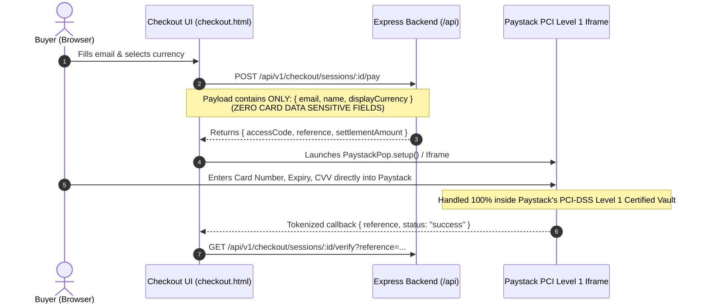

# PCI-DSS Compliance & Multi-Currency Settlement Architecture 📜

This document addresses the compliance requirements, PCI-DSS data flow, and Paystack settlement mechanics for merchants using the **Paystack-Stripe Global Gateway**.

---

## 1. PCI-DSS Compliance: SAQ A Scope

### The Zero-Card-Data Architecture
A common concern for developers building custom checkout forms is **PCI-DSS compliance scope**:
> *"Does my backend server touch, log, or store credit card numbers?"*

**In this gateway, the answer is strictly NO.**



### Key Security Safeguards:
1. **No `name` Attributes on Card Fields:** The card number, expiry, and CVC input fields in `checkout.html` intentionally omit HTML `name` attributes (`name="card_number"`). Even if the user submits the form traditionally, the browser cannot submit card values in the POST body.
2. **PCI Scope:** This architecture qualifies for **PCI-DSS Self-Assessment Questionnaire A (SAQ A)**, the lowest compliance burden possible. Your backend server never stores, processes, or transmits cardholder data (PAN or sensitive authentication data).

---

## 2. Paystack Settlement Modes: USD vs. NGN

Paystack allows merchants in Nigeria and select African regions to receive payouts in two distinct modes. You can configure this via `MERCHANT_SETTLEMENT_CURRENCY` in your `.env`:

### Mode A: Standard NGN Account (Default)
```env
DEFAULT_BASE_CURRENCY=USD
MERCHANT_SETTLEMENT_CURRENCY=NGN
```
- **How it works:** 
  1. Products are priced in USD (e.g. `$9.99/mo`).
  2. The buyer in the US sees `$9.99/mo`. A buyer in China sees `¥72.00/mo`.
  3. Under the hood, the gateway converts `$9.99` to the equivalent NGN amount (e.g. `₦15,300 NGN`).
  4. Paystack executes the charge in NGN.
  5. The international customer's card issuing bank (Chase, Bank of America, HSBC, etc.) automatically converts the NGN amount into the cardholder's home currency at the daily card network rate (Visa/Mastercard rate).
- **Consideration:** Some international cards may incur a small foreign transaction fee (1-3%) from their own bank.

### Mode B: Paystack USD Domiciliary Account (Direct USD Settlement)
```env
DEFAULT_BASE_CURRENCY=USD
MERCHANT_SETTLEMENT_CURRENCY=USD
```
- **How it works:**
  1. If your business has a **Corporate USD Domiciliary Account** registered on your Paystack dashboard, Paystack enables direct USD processing.
  2. The gateway passes USD directly to Paystack (`currency: 'USD'`).
  3. International cards are billed natively in USD. The customer sees USD on their bank statement with zero foreign exchange conversion or bank foreign transaction fees!
  4. Paystack deposits USD directly into your Nigerian domiciliary account.

---

## 3. FX Volatility & Rounding Precision

When settling in NGN for USD-priced goods, exchange rate fluctuations and fractional division can cause minor rounding discrepancies.

To safeguard merchants:
1. **Mathematical Ceiling (`Math.ceil`):** When converting the calculated settlement amount to lowest currency units (kobo/cents), the gateway applies `Math.ceil()`:
   ```javascript
   const amountInKobo = Math.ceil(settlementAmount * Math.pow(10, decimals));
   ```
   This mathematically guarantees that fractional kobo fractions never round downward, ensuring the merchant is never undercharged.
2. **Volatility Buffer (`FX_BUFFER_PERCENT: 1.5`):** Applies a configurable safety margin (default 1.5%) to absorb intraday currency movements between checkout session creation and card settlement.
