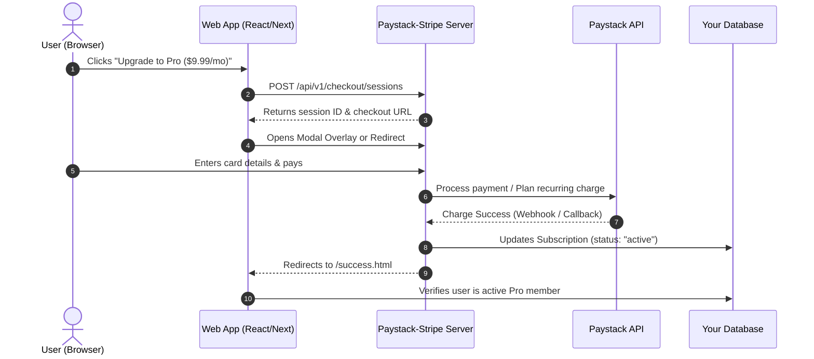

# Universal Integration Guide 🌐

This guide explains how to connect your **Paystack-Stripe Global Gateway** to any frontend application:
- [1. Web Applications (React, Next.js, Vue, Svelte)](#1-web-applications)
- [2. Chrome & Browser Extensions (Manifest V3)](#2-chrome--browser-extensions)
- [3. Mobile Apps (React Native / Expo & Flutter)](#3-mobile-apps)
- [4. Websites & Landing Pages (WordPress, Webflow, HTML)](#4-websites--landing-pages)
- [5. License Verification & Security Architecture](#5-license-verification--security-architecture)

---

## 1. Web Applications

### Architecture Flow:


### React / Next.js Integration

#### Step 1: Add the client SDK or make direct API calls
In your Next.js `/app` or React project:

```tsx
// components/PricingButton.tsx
'use client';

import React, { useState } from 'react';

interface CheckoutButtonProps {
  mode: 'subscription' | 'payment';
  interval?: 'monthly' | 'annually';
  amount: number;
  productName: string;
  userEmail: string;
}

export function CheckoutButton({ mode, interval, amount, productName, userEmail }: CheckoutButtonProps) {
  const [loading, setLoading] = useState(false);

  const handleCheckout = async (openAsModal = true) => {
    setLoading(true);
    try {
      // 1. Call your Gateway Server
      const res = await fetch('https://your-gateway-domain.com/api/v1/checkout/sessions', {
        method: 'POST',
        headers: { 'Content-Type': 'application/json' },
        body: JSON.stringify({
          mode,
          subscription_interval: interval || 'monthly',
          line_items: [
            {
              name: productName,
              amount: amount, // e.g. 9.99
              currency: 'USD',
              quantity: 1
            }
          ],
          customer_email: userEmail,
          success_url: `${window.location.origin}/dashboard?session_id={CHECKOUT_SESSION_ID}`,
          cancel_url: `${window.location.origin}/pricing`
        })
      });

      const session = await res.json();
      if (!session.id) throw new Error(session.error || 'Failed to create session');

      if (openAsModal && window.PaystackStripe) {
        // Open in sleek modal without full-page redirect
        const pss = new window.PaystackStripe({ backendUrl: 'https://your-gateway-domain.com' });
        pss.openModal({
          sessionId: session.id,
          onComplete: (data) => {
            window.location.href = `/dashboard?session_id=${session.id}`;
          }
        });
      } else {
        // Redirect directly to checkout
        window.location.href = session.url;
      }
    } catch (err: any) {
      alert(err.message);
    } finally {
      setLoading(false);
    }
  };

  return (
    <button 
      onClick={() => handleCheckout(true)}
      disabled={loading}
      className="bg-[#635BFF] hover:bg-[#5046E5] text-white font-medium py-3 px-6 rounded-lg transition"
    >
      {loading ? 'Opening Checkout...' : `Get ${productName}`}
    </button>
  );
}
```

#### Step 2: Next.js Middleware Route Protection
Protect premium routes by checking subscription status in your database:

```typescript
// middleware.ts or app/dashboard/page.tsx
import { db } from '@/lib/db';

export async function checkProStatus(userId: string) {
  const sub = await db.subscription.findFirst({
    where: {
      userId,
      status: 'active',
      currentPeriodEnd: { gte: new Date() }
    }
  });

  return Boolean(sub);
}
```

---

## 2. Chrome & Browser Extensions

> **Security Rule:** Never include your `PAYSTACK_SECRET_KEY` inside a browser extension! Anyone can inspect extension files. All sessions must be created via your gateway backend.

### Extension Flow:
1. User clicks **"Upgrade to Pro"** in `popup.html`.
2. `popup.js` requests a session from your backend (`https://your-gateway.com/api/v1/checkout/sessions`).
3. Backend creates the session with metadata: `{ extensionId: chrome.runtime.id, userId: user.id }`.
4. Extension opens the checkout URL in a new tab: `chrome.tabs.create({ url: session.url })`.
5. When the user finishes, your webhook receives the success event, creates a **signed license token** in DB, and sets subscription active.
6. Extension calls `GET /api/v1/license/check?email=...` or checks the session status, storing `{ isPro: true, licenseToken }` in `chrome.storage.local`.

### Chrome Extension Implementation:

```javascript
// popup.js (Manifest V3)
const GATEWAY_API = 'https://your-gateway.com';

document.getElementById('buyProBtn').onclick = async () => {
  const userEmail = document.getElementById('userEmailInput').value;

  // 1. Create checkout session
  const res = await fetch(`${GATEWAY_API}/api/v1/checkout/sessions`, {
    method: 'POST',
    headers: { 'Content-Type': 'application/json' },
    body: JSON.stringify({
      mode: 'subscription',
      subscription_interval: 'monthly',
      line_items: [{ name: 'Extension Pro Plan', amount: 4.99, currency: 'USD' }],
      customer_email: userEmail,
      metadata: { extensionId: chrome.runtime.id }
    })
  });

  const session = await res.json();

  if (session.url) {
    // 2. Remember pending session in local storage
    await chrome.storage.local.set({ pendingSessionId: session.id, userEmail });

    // 3. Open checkout tab
    chrome.tabs.create({ url: session.url });
  }
};

// Periodic license validator (called in background.js alarm)
async function verifyLicense() {
  const { userEmail } = await chrome.storage.local.get(['userEmail']);
  if (!userEmail) return false;

  const res = await fetch(`${GATEWAY_API}/api/v1/license/verify?email=${encodeURIComponent(userEmail)}`);
  const data = await res.json();

  if (data.isPro) {
    await chrome.storage.local.set({ isPro: true, expiry: data.currentPeriodEnd });
    return true;
  } else {
    await chrome.storage.local.set({ isPro: false });
    return false;
  }
}
```

---

## 3. Mobile Apps (React Native, Expo, Flutter)

### Mobile Architecture Flow:
1. Mobile app creates a session via API.
2. Mobile app opens the checkout URL inside an **In-App Browser** (`expo-web-browser` or `flutter_custom_tabs`).
3. Set `success_url` to a custom deep link scheme: `myapp://checkout-success?session_id={CHECKOUT_SESSION_ID}`.
4. When payment completes, browser automatically redirects into your mobile app!
5. Mobile app reads `session_id` from deep link, polls your backend to verify payment, and unlocks features.

### React Native / Expo Example:

```tsx
import React from 'react';
import { View, Button, Alert } from 'react-native';
import * as WebBrowser from 'expo-web-browser';
import * as Linking from 'expo-linking';

export function SubscriptionScreen({ userEmail }: { userEmail: string }) {
  const handleUpgrade = async () => {
    try {
      // 1. Custom app deep link return scheme
      const returnUrl = Linking.createURL('checkout-success');

      // 2. Create session with deep link return
      const res = await fetch('https://your-gateway.com/api/v1/checkout/sessions', {
        method: 'POST',
        headers: { 'Content-Type': 'application/json' },
        body: JSON.stringify({
          mode: 'subscription',
          line_items: [{ name: 'Mobile Pro', amount: 9.99, currency: 'USD' }],
          customer_email: userEmail,
          success_url: `${returnUrl}?session_id={CHECKOUT_SESSION_ID}`,
          cancel_url: Linking.createURL('checkout-cancel')
        })
      });

      const session = await res.json();

      // 3. Open in-app browser
      const result = await WebBrowser.openAuthSessionAsync(session.url, returnUrl);

      if (result.type === 'success' && result.url) {
        const { queryParams } = Linking.parse(result.url);
        const sessionId = queryParams?.session_id;

        // 4. Verify status with backend
        const verifyRes = await fetch(`https://your-gateway.com/api/v1/checkout/sessions/${sessionId}/status`);
        const statusData = await verifyRes.json();

        if (statusData.paymentStatus === 'paid') {
          Alert.alert('Success!', 'Your subscription is now active.');
        }
      }
    } catch (e: any) {
      Alert.alert('Error', e.message);
    }
  };

  return (
    <View style={{ flex: 1, justifyContent: 'center', padding: 20 }}>
      <Button title="Subscribe to Pro ($9.99/mo)" onPress={handleUpgrade} color="#635BFF" />
    </View>
  );
}
```

### Flutter Example:

```dart
import 'package:flutter/material.dart';
import 'package:url_launcher/url_launcher.dart';
import 'package:http/http.dart' as http;
import 'dart:convert';

void startCheckout(String email) async {
  final response = await http.post(
    Uri.parse('https://your-gateway.com/api/v1/checkout/sessions'),
    headers: {'Content-Type': 'application/json'},
    body: jsonEncode({
      'mode': 'subscription',
      'line_items': [{'name': 'Pro Plan', 'amount': 9.99, 'currency': 'USD'}],
      'customer_email': email,
      'success_url': 'myflutterapp://payment-success?session_id={CHECKOUT_SESSION_ID}',
    }),
  );

  final session = jsonDecode(response.body);
  final checkoutUrl = Uri.parse(session['url']);

  if (await canLaunchUrl(checkoutUrl)) {
    await launchUrl(checkoutUrl, mode: LaunchMode.inAppBrowserView);
  }
}
```

---

## 4. Websites & Landing Pages (WordPress, Webflow, Static HTML)

On static landing pages, you can either:
1. **Embed the JavaScript SDK** for a popup modal.
2. **Use a direct link button** to redirect to checkout.

### Static HTML Embed:

```html
<!-- Include SDK in your header or footer -->
<script src="https://your-gateway.com/sdk/paystack-checkout.js"></script>

<!-- Buy Button -->
<button id="buyButton" class="stripe-buy-button">Subscribe - $9.99/mo</button>

<script>
  const pss = new PaystackStripe({ backendUrl: 'https://your-gateway.com' });

  document.getElementById('buyButton').onclick = async () => {
    const session = await pss.createCheckoutSession({
      mode: 'subscription',
      subscription_interval: 'monthly',
      line_items: [{ name: 'Pro Membership', amount: 9.99, currency: 'USD' }],
      success_url: 'https://mywebsite.com/thank-you?session_id={CHECKOUT_SESSION_ID}'
    });

    // Opens Stripe-like modal directly on the landing page!
    pss.openModal({
      sessionId: session.id,
      onComplete: () => {
        window.location.href = 'https://mywebsite.com/thank-you';
      }
    });
  };
</script>
```

---

## 5. License Verification & Security Architecture

### Cryptographic JWT License Keys
For desktop apps or offline tools, your backend can issue a signed JWT license key upon receiving the `charge.success` webhook:

```javascript
import jwt from 'jsonwebtoken';

function generateLicenseToken(customerEmail, planName) {
  return jwt.sign(
    {
      email: customerEmail,
      plan: planName,
      status: 'active',
      issuedAt: Date.now()
    },
    process.env.LICENSE_SECRET_KEY,
    { expiresIn: '365d' } // or no expiration for lifetime
  );
}
```
Your apps can verify this license offline using the public key or secret!
