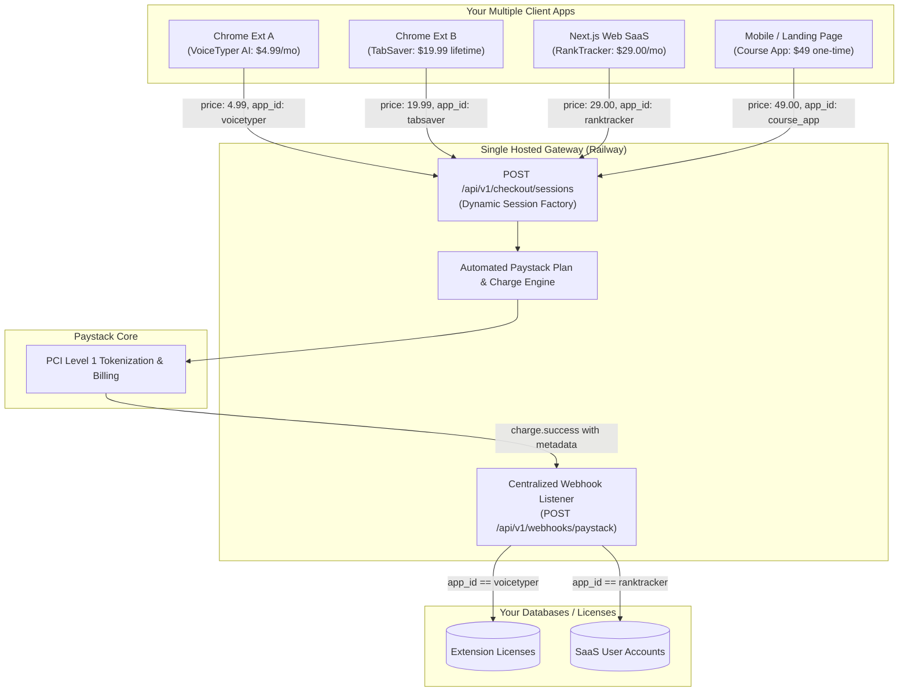

# Multi-App & Dynamic Pricing Architecture 🏢💳

How to connect and monetize **multiple Chrome extensions, SaaS web apps, and mobile apps** with different pricing, intervals, and branding using a **single hosted gateway instance** on Railway.

---

## 🌟 The Core Concept

Like **Stripe Checkout**, this gateway **does NOT hardcode your products, pricing, or brand names**. 

Every payment is initiated as a dynamic **Checkout Session**. This means you do **not** need to deploy separate servers for each app. A single Railway deployment (`https://paystackpg-production.up.railway.app`) can simultaneously power:

- 🧩 **Extension A:** $4.99/month recurring subscription
- 🧩 **Extension B:** $19.99 one-time lifetime license
- 💻 **SaaS Platform C:** $29/month or $290/year team subscription
- 📱 **Mobile App D:** $9.99 credit pack



---

## 🛠️ Dynamic Session Parameters

When an app calls `POST /api/v1/checkout/sessions`, it can customize every aspect of the checkout experience:

| Field | Type | Description | Example |
| :--- | :---: | :--- | :--- |
| `merchant_name` | string | Brand name displayed on the checkout header | `"VoiceTyper AI"` |
| `merchant_logo` | string | URL of the app's logo icon | `"https://myapp.com/logo.png"` |
| `mode` | string | `"payment"` (one-time) or `"subscription"` (recurring) | `"subscription"` |
| `subscription_interval`| string | Billing frequency (`"monthly"`, `"annually"`, `"weekly"`) | `"monthly"` |
| `line_items` | array | Product names, prices, and quantities | `[{ name: "Pro Tier", amount: 4.99, currency: "USD" }]` |
| `metadata` | object | **Custom key-values returned in webhooks** | `{ app_id: "ext_a", user_id: "usr_123" }` |
| `success_url` | string | Where customer is redirected on success | `"https://myapp.com/success"` |
| `cancel_url` | string | Where customer is redirected on cancellation | `"https://myapp.com/pricing"` |

---

## 🧩 Concrete App Integration Examples

### Example 1: Chrome Extension with Monthly Subscription ($4.99/mo)

In your Chrome Extension's `popup.js`:

```javascript
const GATEWAY_URL = 'https://paystackpg-production.up.railway.app';

async function buyMonthlySubscription() {
  const licenseKey = 'lic_' + crypto.randomUUID();

  const response = await fetch(`${GATEWAY_URL}/api/v1/checkout/sessions`, {
    method: 'POST',
    headers: { 'Content-Type': 'application/json' },
    body: JSON.stringify({
      merchant_name: 'VoiceTyper Pro',
      mode: 'subscription',
      subscription_interval: 'monthly',
      line_items: [
        {
          name: 'Unlimited AI Transcriptions',
          amount: 4.99,
          currency: 'USD',
          quantity: 1
        }
      ],
      metadata: {
        app_id: 'voicetyper_chrome_ext',
        license_key: licenseKey,
        client_version: '1.2.0'
      },
      success_url: `${GATEWAY_URL}/success.html?sessionId={CHECKOUT_SESSION_ID}`,
      cancel_url: `${GATEWAY_URL}/cancel.html?sessionId={CHECKOUT_SESSION_ID}`
    })
  });

  const session = await response.json();

  if (session.url) {
    // Save pending key locally
    await chrome.storage.local.set({ pendingLicense: licenseKey, pendingSessionId: session.id });
    // Open hosted checkout tab
    chrome.tabs.create({ url: session.url });
  }
}
```

---

### Example 2: Chrome Extension with One-Time Lifetime License ($19.99)

In your second Chrome Extension:

```javascript
const GATEWAY_URL = 'https://paystackpg-production.up.railway.app';

async function buyLifetimeLicense() {
  const response = await fetch(`${GATEWAY_URL}/api/v1/checkout/sessions`, {
    method: 'POST',
    headers: { 'Content-Type': 'application/json' },
    body: JSON.stringify({
      merchant_name: 'TabSaver Supreme',
      mode: 'payment', // One-time charge
      line_items: [
        {
          name: 'Lifetime Access License',
          amount: 19.99,
          currency: 'USD',
          quantity: 1
        }
      ],
      metadata: {
        app_id: 'tabsaver_chrome_ext',
        install_id: (await chrome.storage.local.get('installId')).installId
      },
      success_url: `${GATEWAY_URL}/success.html?sessionId={CHECKOUT_SESSION_ID}`,
      cancel_url: `${GATEWAY_URL}/cancel.html?sessionId={CHECKOUT_SESSION_ID}`
    })
  });

  const session = await response.json();
  if (session.url) {
    chrome.tabs.create({ url: session.url });
  }
}
```

---

### Example 3: SaaS Web Application with Multi-Tier Plans ($29/mo or $290/yr)

In your React / Next.js web application:

```tsx
// components/CheckoutTrigger.tsx
export async function createSaaSCheckout(tier: 'monthly' | 'annually', userEmail: string, userId: string) {
  const isAnnual = tier === 'annually';

  const response = await fetch('https://paystackpg-production.up.railway.app/api/v1/checkout/sessions', {
    method: 'POST',
    headers: { 'Content-Type': 'application/json' },
    body: JSON.stringify({
      merchant_name: 'RankTracker SaaS',
      merchant_logo: 'https://myranktracker.com/logo.png',
      mode: 'subscription',
      subscription_interval: isAnnual ? 'annually' : 'monthly',
      customer_email: userEmail,
      line_items: [
        {
          name: isAnnual ? 'Agency Annual Plan (2 Months Free)' : 'Agency Monthly Plan',
          amount: isAnnual ? 290.00 : 29.00,
          currency: 'USD',
          quantity: 1
        }
      ],
      metadata: {
        app_id: 'ranktracker_web',
        user_id: userId,
        billing_cycle: tier
      },
      success_url: 'https://myranktracker.com/dashboard?payment=success&session_id={CHECKOUT_SESSION_ID}',
      cancel_url: 'https://myranktracker.com/pricing'
    })
  });

  const session = await response.json();
  window.location.href = session.url;
}
```

---

## ⚡ Automated Paystack Plan Generation

When an app requests a subscription (e.g. $4.99/mo or $290/yr), you **never need to pre-create plans in your Paystack dashboard**.

The gateway automatically handles this on the fly:
1. Calculates the settlement amount in merchant currency (e.g. NGN).
2. Generates an automated, unique Paystack plan formatted as:
   ```
   [Merchant Name] - [Line Item Name] ([Interval])
   ```
   *(e.g., `VoiceTyper Pro - Unlimited AI Transcriptions (monthly)`)*
3. Automatically reuses existing matching plans or creates new ones via Paystack Plan API.

---

## 🎯 Centralized Webhook Routing

Because all apps send events to the same Paystack Webhook (`POST /api/v1/webhooks/paystack`), use **`metadata.app_id`** to route fulfillment:

```javascript
// Inside your webhook handler (or src/routes/webhookRoutes.js)
router.post('/webhooks/paystack', (req, res) => {
  const event = req.body;

  if (event.event === 'charge.success') {
    const meta = event.data.metadata || {};
    const appId = meta.app_id;

    switch (appId) {
      case 'voicetyper_chrome_ext':
        // Unlock VoiceTyper license in DB or license server
        console.log(`[VoiceTyper] Activating license key: ${meta.license_key}`);
        break;

      case 'tabsaver_chrome_ext':
        // Unlock TabSaver license
        console.log(`[TabSaver] License activated for install: ${meta.install_id}`);
        break;

      case 'ranktracker_web':
        // Upgrade SaaS user account
        console.log(`[RankTracker] Upgrading user: ${meta.user_id}`);
        break;

      default:
        console.log('[Webhook] Unhandled app_id:', appId);
    }
  }

  res.status(200).send('Webhook processed');
});
```

---

## 🔒 Security & CORS for Multiple Apps

In your Railway environment variables, ensure `ALLOWED_ORIGINS` is configured:

1. **For Chrome Extensions & Web Apps (Default / Recommended):**
   ```env
   ALLOWED_ORIGINS=*
   ```
   *Chrome extensions run on unique browser origins (`chrome-extension://<id>`), so wildcard `*` allows all your extensions and web apps to create sessions securely without CORS rejections.*

2. **In Chrome Extension `manifest.json`:**
   Add your Railway URL to `host_permissions`:
   ```json
   {
     "manifest_version": 3,
     "name": "My Extension",
     "host_permissions": [
       "https://paystackpg-production.up.railway.app/*"
     ]
   }
   ```
